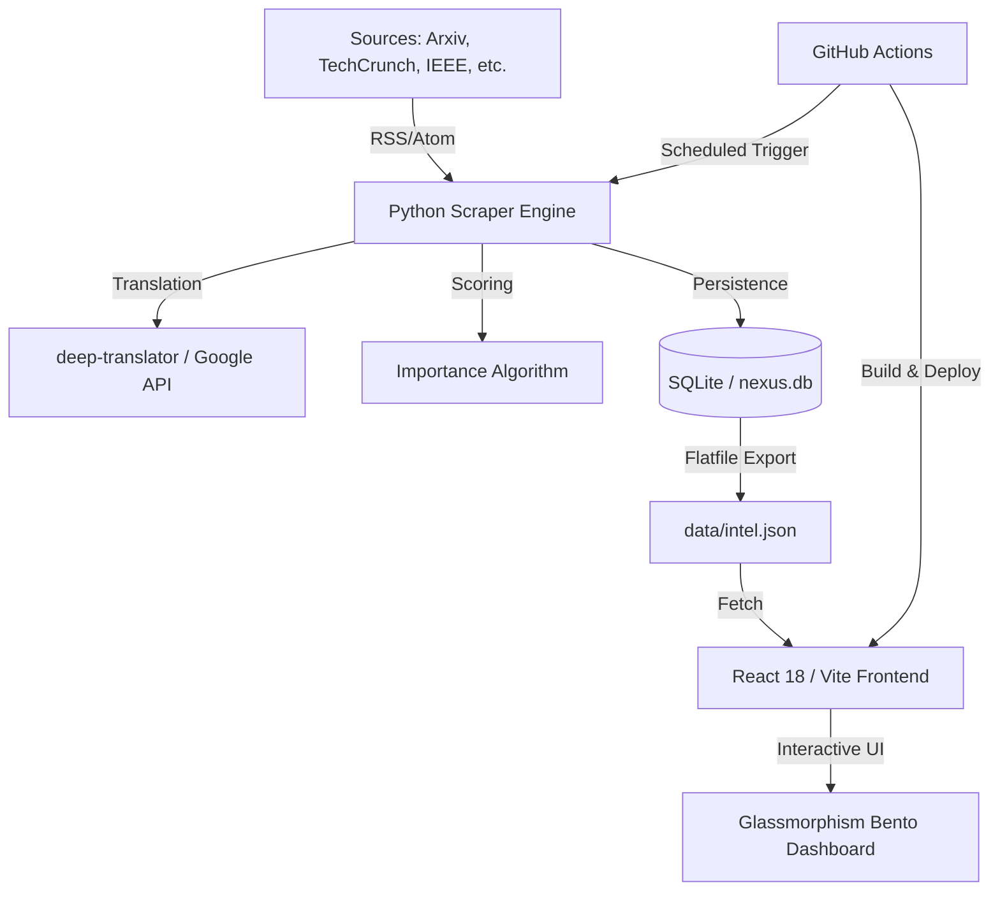
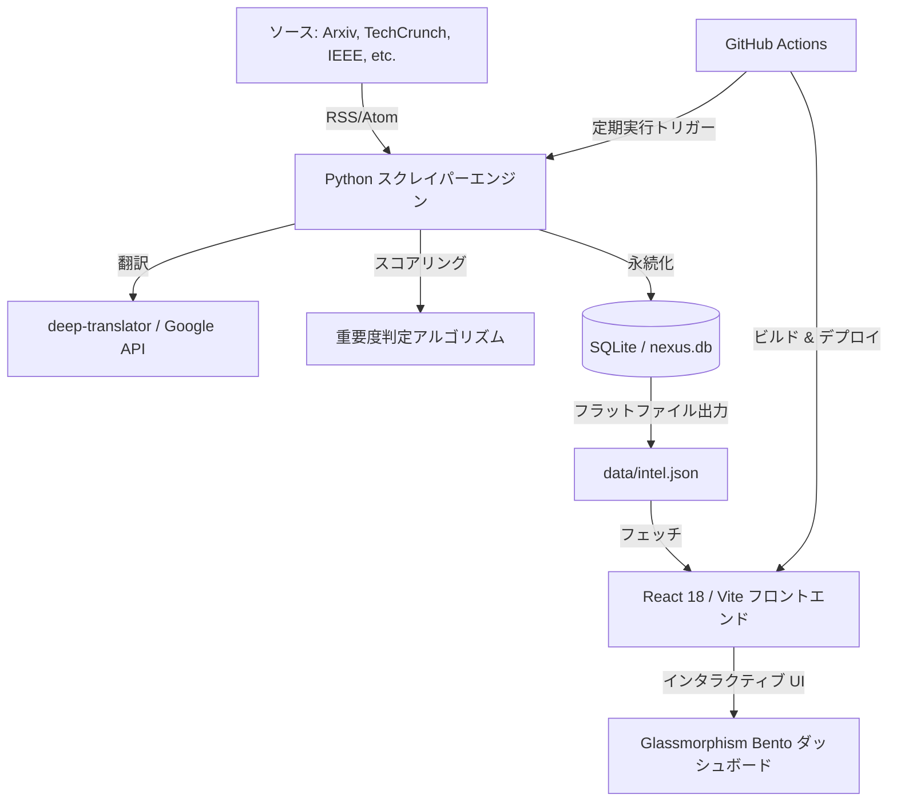

# Nexus Intel 🌐 | Serverless Global Intelligence Hub

[](https://reactjs.org/)
[](https://www.python.org/)
[](https://github.com/features/actions)
[](https://opensource.org/licenses/MIT)

> **"Turning the world's noise into actionable intelligence."**  
> Nexus Intel is a high-performance, serverless intelligence pipeline that translates, scores, and visualizes global news in a premium Cyber-Glass dashboard.

[English](#english) | [日本語](#日本語)

---

<a name="english"></a>
## 🌐 English: Project Overview & Technical Deep-Dive

### 📖 Motivation
Information is the ultimate currency, but "Information Overload" is the ultimate tax. **Nexus Intel** was built to provide a zero-noise, high-signal intelligence experience. By combining distributed RSS feeds, automated NLP translation, and high-end reactive design, it delivers a curated view of the global tech landscape with **zero operational infrastructure costs**.

### 🛠️ Technical Architecture



#### 🐍 Backend: The Intelligence Pipeline
The backend is a robust Python engine (`scrapers/collector.py`) that operates on a 60-minute automated cycle.

- **Intelligent Deduplication**: Every incoming URL is hashed and cross-checked against a localized SQLite database (`nexus.db`) to ensure zero redundancy.
- **Automated Headline Translation**: Powered by the `deep-translator` library, titles are processed from their source language (primarily English) into high-fidelity Japanese.
- **Importance Scoring Algorithm**: Not all news is equal. Nexus Intel applies a deterministic scoring logic:
  ```python
  def score_importance(title, summary):
      score = 1
      keywords = {
          'Breakthrough': 3, 'World First': 3,  # Critical Signals
          'AI': 2, 'GPT': 2, 'Robot': 2,        # Industry Focus
          'Crisis': 2, 'Launch': 2             # Movement Signals
      }
      # ... keyword extraction & normalization ...
      return min(score, 5) # 5-Star Scale
  ```

#### ⚛️ Frontend: The "Cyber-Glass" Interface
The dashboard is a high-end React 18 application optimized for performance and aesthetics.

- **Glassmorphism Design System**: Built with modern CSS (`style.css`), utilizing HSL color tokens and `backdrop-filter: blur(12px)` for a semi-transparent, premium UI.
- **Bento Box Grid**: A dynamic CSS Grid layout where "Hero Cards" (the top-scored intel) automatically expand to occupy larger visual real estate.
- **Optimization Strategy**:
    - **`useMemo` Hook**: Used to wrap the filtering and search logic, ensuring that even with 100+ items, the search feel is instantaneous (sub-5ms update).
    - **Client-Side Persistence**: Bookmark IDs are stored in `localStorage`, maintaining user state across sessions without a backend database.

---

<a name="日本語"></a>
## 🇯🇵 日本語: プロジェクト概要と技術的な詳細

### 📖 開発の動機
現代において情報は最大の資産ですが、「情報の過多」は最大のコストです。**Nexus Intel**（ネクサス・インテル）は、ノイズを極限まで排除し、有用なシグナルのみを抽出するインテリジェンス体験を提供するために開発されました。世界各国の RSS フィード、自動 NLP 翻訳、そして洗練されたリアクティブ・デザインを組み合わせることで、**インフラ運用コスト 0 円**で、世界のテック動向をリアルタイムに俯瞰することを可能にします。

### 🛠️ システム・アーキテクチャ



#### 🐍 バックエンド: インテリジェンス・パイプライン
バックエンドは、60 分サイクルで自動稼働する堅牢な Python エンジン (`scrapers/collector.py`) で構成されています。

- **高度な重複排除**: すべての URL はハッシュ化され、ローカルの SQLite データベース (`nexus.db`) と照合されます。これにより、同じニュースが二度表示されることはありません。
- **全自動ヘッドライン翻訳**: `deep-translator` ライブラリを介して、海外メディア（主に英語）のタイトルを精度高く日本語へ変換します。
- **重要度スコアリング・アルゴリズム**: すべてのニュースが同じ価値を持つわけではありません。Nexus Intel では以下の決定論的ロジックを採用しています。
  ```python
  def score_importance(title, summary):
      score = 1
      keywords = {
          'Breakthrough': 3, '世界初': 3,     # クリティカル・シグナル
          'AI': 2, 'GPT': 2, 'Robot': 2,      # 重点産業
          '危機': 2, 'Launch': 2              # 動向シグナル
      }
      # ... キーワード抽出 & 正規化ロジック ...
      return min(score, 5) # 5段階評価
  ```

#### ⚛️ フロントエンド: 「Cyber-Glass」インターフェース
ダッシュボードは、パフォーマンスと美学を極限まで追求した React 18 アプリケーションです。

- **グラスモーフィズム・デザイン**: HSL カラー・トークンと `backdrop-filter: blur(12px)` を駆使した現代的な CSS (`style.css`) 背景設計。
- **Bento Box グリッド**: 動的な CSS Grid レイアウト。重要度が高いと判定された記事（Hero Card）は自動的にグリッド内で大きく表示され、ユーザーの視線を誘導します。
- **パフォーマンス最適化手法**:
    - **`useMemo` フック**: 膨大なデータセット（100 件以上）でも、ミリ秒単位（5ms 以下）の検索・フィルタリング更新を実現。
    - **クライアントサイド永続化**: ブックマーク ID は `localStorage` に保存され、サーバーレス構成でありながらユーザーの状態をセッションを跨いで保持します。

---

## 📂 Directory Structure / ディレクトリ構成

```text
nexus-intel/
├── .github/workflows/   # CI/CD: Hourly Python scraper & Vite auto-deploy
├── backend/             # (Placeholder) Reserved for future API extensions
├── scrapers/            
│   └── collector.py     # CORE: Python intelligence engine (Scrape/Translate/Score)
├── data/                
│   ├── nexus.db         # Persistent SQLite store (Deduplication)
│   └── intel.json       # Production data source (Minified JSON)
├── frontend/            
│   ├── src/             
│   │   ├── App.jsx      # Dashboard Logic (React/i18n/Filters)
│   │   └── style.css    # Premium CSS Architecture (Glassmorphism)
│   └── index.html       
└── README.md            # You are here
```

---

## 🚀 Local Setup / ローカルセットアップ

### Prerequisites
- **Node.js**: v20 or higher
- **Python**: v3.12 or higher

### 1. Installation
```bash
git clone https://github.com/WaRara-men/nexus-intel.git
cd nexus-intel
```

### 2. Run the Intelligence Pipeline
```bash
# Setup backend dependencies
pip install -r requirements.txt

# Execute data collection manually
python scrapers/collector.py
```

### 3. Launch the Dashboard
```bash
cd frontend
npm install
npm run dev
```

---

## 🛠️ Tech Stack / 使用技術

- **Language**: Python 3.12 (Engines), JavaScript/JSX (UI)
- **UI Frameworks**: React 18, Vite, Lucide-React
- **Styling**: Vanilla CSS (Cyber-Glass UI Architecture)
- **NLP/Translators**: Deep-Translator (Google)
- **Automation**: GitHub Actions (Cron Jobs)
- **Deployment**: GitHub Pages

---

## 📝 License
Distributed under the MIT License. See `LICENSE` for more information.

---
Built with ❤️ by [WaRara-men](https://github.com/WaRara-men)
