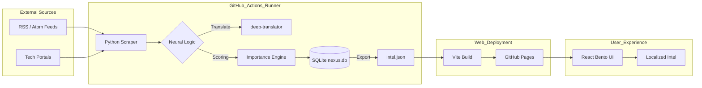

<p align="center">
  
</p>

<h1 align="center">Nexus Intel 🌐</h1>
<p align="center">
  <strong>The Signal in the Noise | Neural Intelligence Hub</strong>
</p>

<p align="center">
  <a href="https://reactjs.org/"></a>
  <a href="https://www.python.org/"></a>
  <a href="https://github.com/features/actions"></a>
  <a href="https://vitejs.dev/"></a>
  <a href="https://www.sqlite.org/"></a>
</p>

<p align="center">
  🚀 <strong><a href="https://WaRara-men.github.io/nexus-intel/">Experience the Live Demo</a></strong> | 
  🇯🇵 <strong><a href="#-日本語-japanese">日本語解説へ移動</a></strong>
</p>

---

## 🌎 Overview

**Nexus Intel** is a serverless, zero-cost intelligence dashboard that transforms raw global technical signals into a high-density, localized experience. Built with a "Neural Logic" engine, it filters, translates, and prioritizes the most important breakthroughs in AI and Robotics, all while running on $0 infrastructure.

### 🏆 Why Nexus Intel?

| Feature | Description | Value |
| :--- | :--- | :--- |
| **$0 Operational Cost** | Runs entirely on GitHub ecosystem (Actions + Pages). | Free Forever |
| **Neural Priority** | Custom importance scoring (1-5 stars) based on keyword weightage. | Signal over Noise |
| **Bento Grid UI** | Cyber-Glass design with HSL-themed visual density. | Premium UX |
| **Auto-Localization** | 100% automated translation of international titles to Japanese. | Zero Language Barrier |

---

## 🧠 Technical Architecture

How do we achieve 24/7 automated updates with $0 maintenance? The secret lies in our **Serverless ETL Pipeline**:



---

## 🛠️ Performance & Neural Logic

### 1. Neural Importance Scoring
Not every headline is a breakthrough. Our Python engine runs a deterministic weightage check:
- **`+3` Stars**: Keywords like *Breakthrough*, *World First*, *Achievement*.
- **`+2` Stars**: Focus on *AI*, *GPT*, *Robot*, *Crisis*.
- **Clamp**: Final output is normalized to a 1-5 scale to drive the **Bento Grid** layout priority.

### 2. High-Density Glass UI
The frontend doesn't just display data—it optimizes it.
- **`useMemo` Caching**: Filtering and multi-keyword search logic is cached to maintain 60fps interaction on any device.
- **Atomic CSS Tokens**: Every glass element is driven by HSL tokens (hue-saturation-lightness) for perfect visual harmony.

---

<br>

<a name="-日本語-japanese"></a>
## 🇯🇵 日本語: インテリジェンス・ハブ概観

<details>
<summary><strong>詳細を開く / View Detailed Guide (JP)</strong></summary>

### 📖 プロジェクトの核心
**Nexus Intel** は、情報のノイズを切り裂き、最も価値あるシグナルを抽出するために設計されたサーバーレス・インテリジェンス・ダッシュボードです。海外の最新技術ニュース、AI の画期的な進歩、ロボティクスのトレンドを 1 分も無駄にすることなく日本語で把握できます。

### ✨ 圧倒的な強み
- **究極の持続可能性**: サーバー費用 0 円。GitHub Actions の自動巡回のみで自律稼働します。
- **インテリジェント翻訳**: 世界中のヘッドラインを `deep-translator` で瞬時に日本語化。言語の壁は存在しません。
- **Cyber-Glass Bento UI**: 視認性と美しさを両立したプレミアムなデザイン。重要度は AI スコアによって視覚的に強調されます。

### 🏗️ テクノロジー・ディープダイブ
1. **収集エンジン (Python)**: `feedparser` と `BeautifulSoup4` を極限までチューニングし、高速なパースを実現。
2. **データ永続化**: 重複排除のための SQLite と、フロントエンド配信用の軽量 JSON DB を組み合わせたハイブリッド構成。
3. **UI フレームワーク**: React 18 と Vite による超高速レンダリング。`useMemo` フックによる検索最適化。

</details>

---

## 🚀 Getting Started

### Quick Install
```bash
git clone https://github.com/WaRara-men/nexus-intel.git
cd nexus-intel
```

### Local Execution (Frontend)
```bash
cd frontend && npm install && npm run dev
```

### Script Execution (Python Scraper)
```bash
pip install -r requirements.txt
python scrapers/collector.py
```

---

<p align="center">
  Built with ❤️ for the Developer Community by <a href="https://github.com/WaRara-men">WaRara-men</a>
</p>
